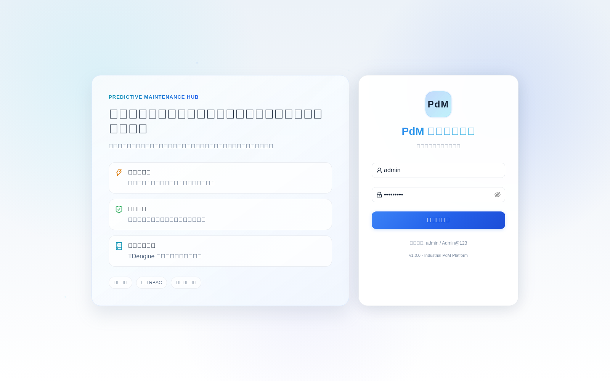
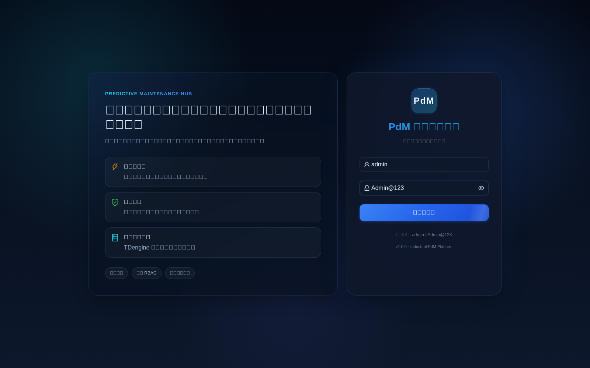
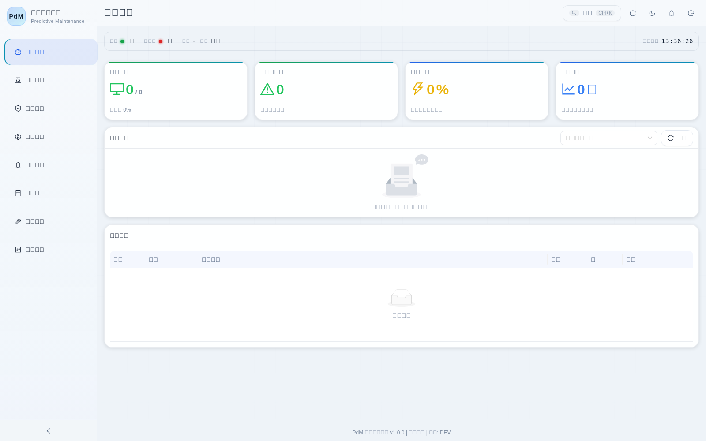
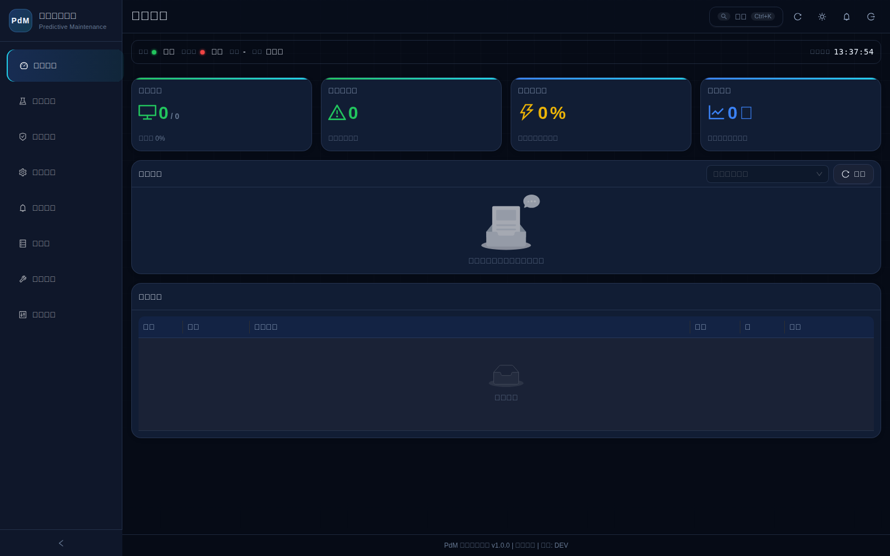
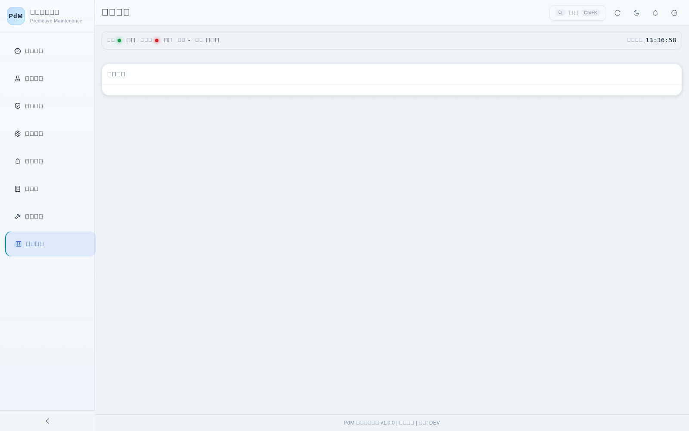
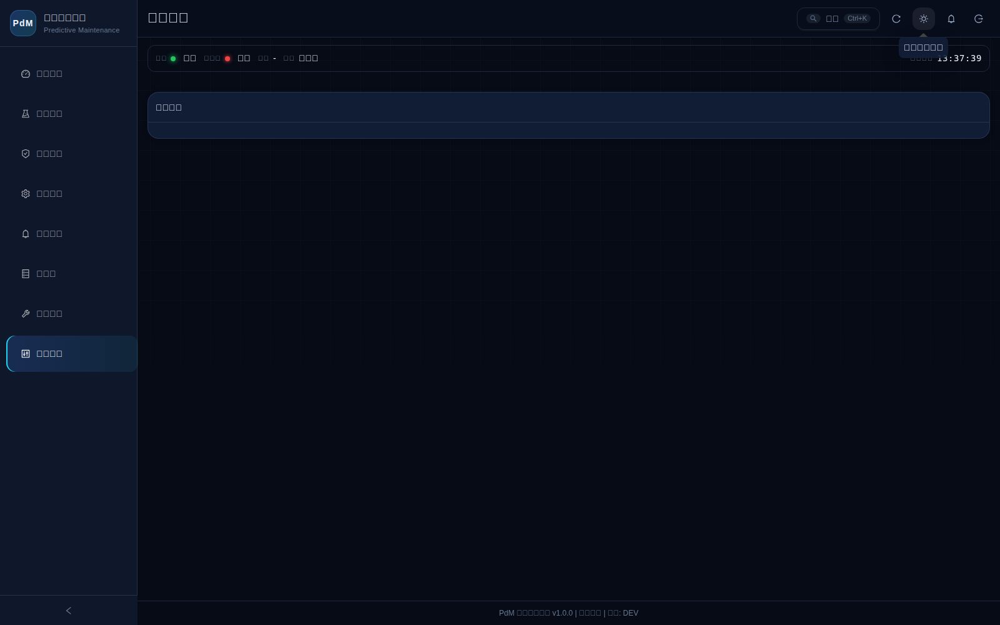

# PdM 智能运维平台
by Claude Opus 4.6

工业设备预测性维护平台，覆盖机加、复材铺丝、激光焊接、检验监测等场景。当前工程为可运行版本。

## 1. 技术栈

### 后端
- Python 3.11 + FastAPI 0.115.x
- SQLite（`sqlite3` 标准库，WAL 模式，持久化存储）
- python-jose (JWT HS256) + bcrypt（认证与安全）
- httpx（HTTP 客户端，用于 Webhook 推送）
- pydantic-settings（配置管理）

### 前端
- React 18.3 + TypeScript + Vite 6.x
- Ant Design 5.24.x + @ant-design/icons
- ECharts 5.6 + echarts-for-react（图表）
- react-router-dom 6.x（HashRouter）
- axios 1.7.x

### 基础设施
- Docker Compose v3.9
- TDengine 3.3.4.3（时序运行数据存储，REST SQL，不依赖 libtaos）
- Nginx Alpine（前端生产部署）

## 2. 主要能力

- 登录认证与角色权限控制（JWT + RBAC）
- **完整设备台账管理**（型号、厂家、年份、序列号、维保记录、数据源关联）
- **设备详情聚合视图**（基本信息、维保记录、告警历史、预测历史、运行数据）
- 告警管理、规则中心
- **多算法预测（基于真实运行数据）**：规则引擎、Z-score 统计分析、隔离森林 ML、Holt 双指数平滑时序预测
- **算法内部参数配置**（每个算法的阈值、均值、标准差、置信度范围等均可调节）
- 算法模板管理（保存当前配置、套用、导入、导出）
- **模板套用功能打通**（套用后自动加载配置到预测中心）
- 治理审计日志
- 通知事件推送（HMAC 签名）与失败重试
- TDengine 运行数据采集与趋势查询
- **Dashboard KPI 动态计算**（平均风险分、预测次数从真实数据获取）
- 系统健康状态显示（平台服务 + TDengine）
- **系统管理页面**（版本信息、TDengine 连接状态、通知配置编辑）
- **全数据持久化**（SQLite WAL + Docker Named Volume，重启/崩溃零数据丢失）

## 3. 前端页面与交互

### 路由页面
- `/dashboard` 运行总览（KPI 动态计算）
- `/devices` 设备管理（完整台账：型号/厂家/年份/序列号，含新建/编辑/删除）
- `/devices/:id` 设备详情（5 Tab：基本信息、维保记录、告警历史、预测历史、运行数据）
- `/prediction` 预测中心（含高级算法参数配置面板）
- `/rules` 规则中心
- `/governance` 算法治理（模板创建使用当前配置、套用跳转预测页、展开行查看参数详情）
- `/notifications` 通知中心
- `/datasources` 数据源配置
- `/system` 系统管理（版本信息、TDengine 状态、通知配置）

### 交互增强
- 顶部设备与高风险告警快捷标签（可展开明细抽屉）
- 顶部通知中心抽屉（未处理计数、最近事件、快速重试）
- 全局快捷导航（Ctrl + K）
- 路由切页过渡动画
- 深色企业主题与移动端自适应，亮色主题可切换
- 预测页可折叠"算法参数配置"面板，支持恢复默认

### 页面截图（亮/暗主题）

#### 登录页面

| 亮色主题 | 暗色主题 |
| --- | --- |
|  |  |

#### 首页（运行总览）

| 亮色主题 | 暗色主题 |
| --- | --- |
|  |  |

#### 系统管理

| 亮色主题 | 暗色主题 |
| --- | --- |
|  |  |

## 4. 目录结构

~~~text
PdM/
├─ backend/
│  ├─ app/
│  │  ├─ routers/                # 业务接口（13 个路由文件）
│  │  ├─ services/               # 预测、TDengine、通知等服务
│  │  │  └─ algorithms/          # 4 种预测算法实现（rule_based/statistical/ml/deep_learning）
│  │  ├─ db/
│  │  │  ├─ database.py          # SQLite 连接管理 + DDL（12 张表）
│  │  │  ├─ models.py            # Pydantic 数据模型（25+ 个）
│  │  │  └─ store.py             # SQLite CRUD 函数集（替代内存字典）
│  │  └─ core/                   # 配置与安全基础
│  └─ requirements.txt
├─ frontend/
│  ├─ src/
│  │  ├─ pages/                  # 10 个路由页面
│  │  ├─ components/             # 公共组件（CommandPalette）
│  │  ├─ types/                  # 领域类型与中文标签常量
│  │  ├─ App.tsx
│  │  └─ styles.css
│  └─ package.json
├─ docs/
│  └─ notification-contract.md  # 通知推送协议
├─ docker-compose.yml
├─ .env.example
├─ project-summary-by-opus46.md  # 完整技术文档
└─ README.md
~~~

## 5. 快速启动（推荐）

### 前置条件
- Docker Desktop（或可用的 Docker Engine + Compose）

### 步骤
1. 复制环境文件

~~~bash
cp .env.example .env
~~~

Windows PowerShell 可用：

~~~powershell
Copy-Item .env.example .env
~~~

2. 启动服务

~~~bash
docker compose up --build -d
~~~

3. 访问地址
- 前端: http://localhost:5173
- 后端 Swagger: http://localhost:8000/docs

## 6. 本地开发（不使用 Docker）

### 后端

~~~bash
cd backend
pip install -r requirements.txt
# 需要在 /app/data 目录存在或修改 database.py 中的 DB_PATH
uvicorn app.main:app --reload --port 8000
~~~

### 前端

~~~bash
cd frontend
npm install
npm run dev
~~~

## 7. 默认账号

- 用户名: admin
- 密码: Admin@123

说明：服务启动时会自动种子初始化默认管理员、6 台样例设备（含完整台账信息）、15 条维保记录、样例规则、样例算法模板和演示告警数据。数据持久化到 SQLite，重启后保留。

## 8. 数据持久化

- **后端数据**：SQLite 数据库，文件存储于容器内 `/app/data/pdm.db`
- **Docker Volume**：`pdm_data` Named Volume 挂载到 `/app/data`，容器重建后数据保留
- **WAL 模式**：启用 `PRAGMA journal_mode=WAL`，支持并发读，写入崩溃安全
- **覆盖范围**：用户、设备台账、告警、规则、预测结果、算法模板、审计日志、通知事件、数据源配置、维保记录、系统设置

清理数据（重置为种子初始状态）：
~~~bash
docker compose down -v   # 删除 volume
docker compose up -d     # 重新启动并重新播种
~~~

## 9. 环境变量说明

请参考 .env.example，关键变量如下：

- JWT_SECRET
- ACCESS_TOKEN_EXPIRE_MINUTES
- CORS_ORIGINS
- PY_ENV
- TDENGINE_HOST
- TDENGINE_PORT
- TDENGINE_USER
- TDENGINE_PASSWORD
- TDENGINE_DATABASE
- DEFAULT_WEBHOOK_URL
- WEBHOOK_SIGNING_SECRET

安全建议：
- 生产环境必须设置强随机 JWT_SECRET 与 WEBHOOK_SIGNING_SECRET。
- 生产环境建议设置 PY_ENV=prod。

## 10. TDengine 说明（重要）

- 后端通过 REST SQL 访问 TDengine（端口 6041），不依赖本地 taos 动态库。
- Compose 健康检查必须可访问：

~~~text
http://localhost:6041/rest/login/root/taosdata
~~~

- TDengine 仅存储时序运行数据（温度/振动/压力/转速）；业务数据（设备、告警、预测等）均存储在 SQLite。

## 11. 核心 API 列表

### 认证与用户
- POST /auth/token
- GET /users/me
- GET /users
- POST /users

### 设备与维保
- GET /devices
- POST /devices
- GET /devices/{id}
- PUT /devices/{id}
- DELETE /devices/{id}
- GET /devices/{id}/maintenance
- POST /devices/{id}/maintenance
- DELETE /devices/{id}/maintenance/{record_id}
- GET /devices/{id}/alerts
- GET /devices/{id}/predictions

### 告警与规则
- GET /alerts
- POST /alerts
- GET /rules
- POST /rules
- POST /rules/{rule_id}/toggle

### 预测与治理
- POST /predictions/infer（支持 algo_params 算法参数配置）
- GET /predictions/stats
- GET /predictions/algorithms（算法列表）
- GET /predictions/algorithms/{algo_key}/source（算法源码查看）
- GET /algo-governance/templates
- POST /algo-governance/templates
- PUT /algo-governance/templates/{template_id}
- DELETE /algo-governance/templates/{template_id}
- GET /algo-governance/templates/export
- POST /algo-governance/templates/import
- POST /algo-governance/evaluations
- GET /algo-governance/evaluations
- GET /algo-governance/audit-logs

### 运行数据与通知
- POST /telemetry/ingest
- GET /telemetry/{device_id}
- POST /notifications/push
- GET /notifications/events
- POST /notifications/retry-failed

### 系统与健康
- GET /system/info
- GET /system/settings
- PUT /system/settings（admin）
- GET /datasources
- POST /datasources
- PUT /datasources/{id}
- DELETE /datasources/{id}
- POST /datasources/{id}/test
- POST /datasources/test-new
- GET /health

## 12. 通知签名与回调协议

通知外推协议见：docs/notification-contract.md

## 13. 常见问题

### Q1：前端启动了但请求后端失败
- 检查 backend 容器是否正常。
- 检查浏览器网络请求目标是否为 http://localhost:8000。

### Q2：backend 启动慢或 TDengine 报错
- 先确认 tdengine 容器健康状态。
- 确认 TDengine 健康检查 URL 使用 /rest/login/root/taosdata。

### Q3：登录失败
- 使用默认账号 admin / Admin@123。
- 若数据有问题，可执行 `docker compose down -v && docker compose up -d` 清空数据重置。

### Q4：数据重启后丢失
- 确认 docker-compose.yml 中 backend 服务挂载了 `pdm_data` volume。
- 不要使用 `docker compose down -v`（会删除 volume），使用 `docker compose restart`。

## 14. 验收建议

1. 启动后可访问前端与 /docs。
2. 使用默认账号登录成功。
3. 所有路由页面可正常切换（Dashboard、设备管理、预测中心、规则、治理、通知、数据源、系统管理）。
4. 设备管理页显示 6 台设备完整台账信息（型号/厂家/年份）。
5. 点击设备进入详情，5 个 Tab 均正常加载。
6. 运行预测可返回结果并在治理日志中看到记录。
7. 预测中心展开"算法参数配置"，修改参数后运行预测，确认结果受参数影响。
8. Dashboard"平均风险分"和"最近预测"在运行预测后动态更新。
9. 通知中心可查看事件并重试失败消息。
10. 系统管理页显示版本、TDengine 连接状态，通知 Webhook 可编辑。
11. `docker restart pdm-backend` 后登录仍成功，预测记录仍存在。
